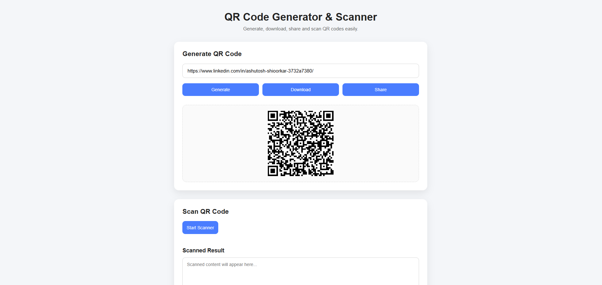
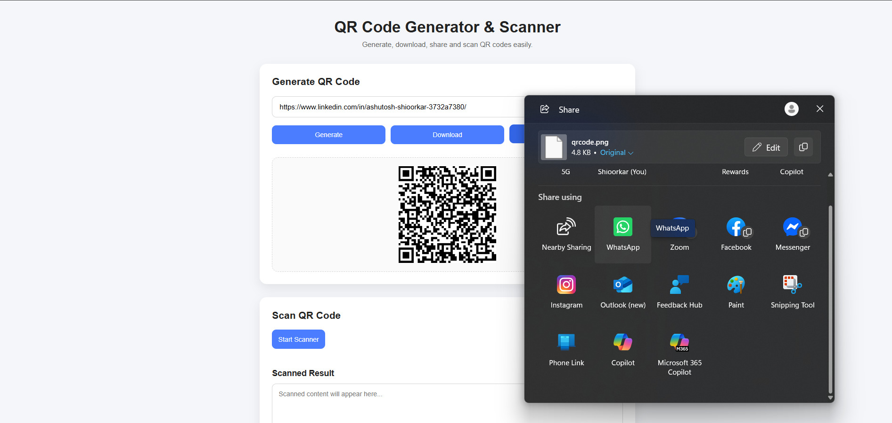
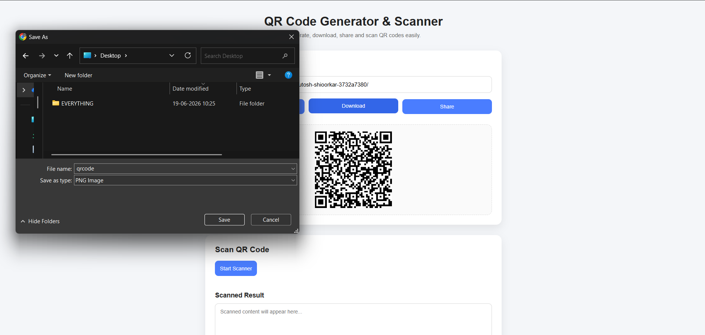

# 📱 QR Code Generator & Scanner

A simple and responsive web application to generate and scan QR codes directly in the browser. Users can create QR codes from any text or URL, download them as PNG images, share them, and scan QR codes using their device's camera.

---

## ✨ Features

- 🔲 Generate QR codes from text or URLs
- 💾 Download generated QR codes as PNG
- 📤 Share QR codes (supported browsers)
- 📷 Scan QR codes using webcam
- 📋 Copy scanned text
- 🌐 Open scanned links directly
- 📱 Fully responsive design

---

## 🛠️ Built With

- HTML5
- CSS3
- JavaScript (Vanilla)
- QRCode.js
- html5-qrcode

---

## 📂 Project Structure

```
qr-code-generator/
│
├── index.html
├── style.css
├── script.js
└── README.md
```

---

## 🚀 Getting Started

1. Clone the repository

```bash
git clone https://github.com/your-username/qr-code-generator.git
```

2. Open the project folder.

3. Open `index.html` in your browser.

No installation required.

---

## 📸 Screenshots

### Home Page



### Share QR Code



### Download QR Code



---

## 📚 Libraries Used

- QRCode.js
- html5-qrcode

---

## 🌟 Future Improvements

- QR color customization
- QR size selector
- Scan QR from uploaded image
- QR history
- Dark mode
- Custom logo inside QR

---

---
## LIVE AT : 

## 👨‍💻 Author

Made with ❤️ by **ASHUTOSH SHIOORKAR**
